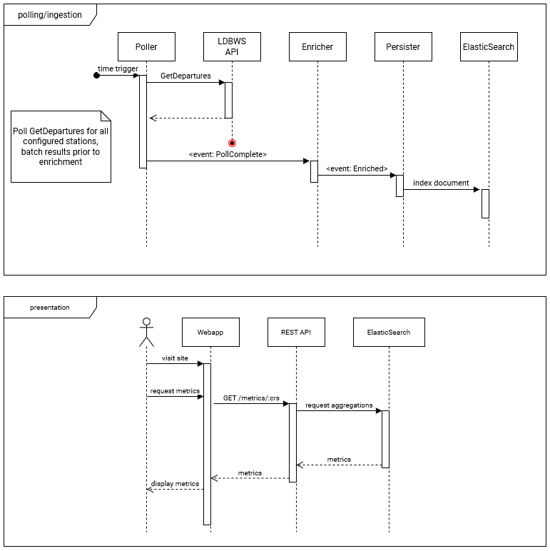

# 10k Trains

An attempt to derive metrics from train departure boards. Maybe that will actually
be useful to somebody.



This only looks like microservices, everything is in one app. However the different
modules will talk to each other using the application event bus like it's kafka.

## Setup

1. Download [`apache-cxf-3.4.5`][cxf] and extract it into `./apache-cxf-3.4.5`
2. Regenerate the client using the `:generateCodeFromWsdl` task
3. Copy `application-local.sample.yaml` to `application-local.yaml`
4. Update your LDB API token in `application-local.yaml`
5. Make sure you run the app locally with the Spring profile set to `local`

## Local run

This project contains a `Boot Run` configuration for IntelliJ Community Edition
that sets the `local` profile and uses the `:bootRun` task. Otherwise, try:

```
# PowerShell, Windows
$env:SPRING_PROFILES_ACTIVE="local"; .\gradlew.bat :bootRun

# Bash
SPRING_PROFILES_ACTIVE=local ./gradlew :bootRun
```

[cxf]: http://cxf.apache.org/download.html